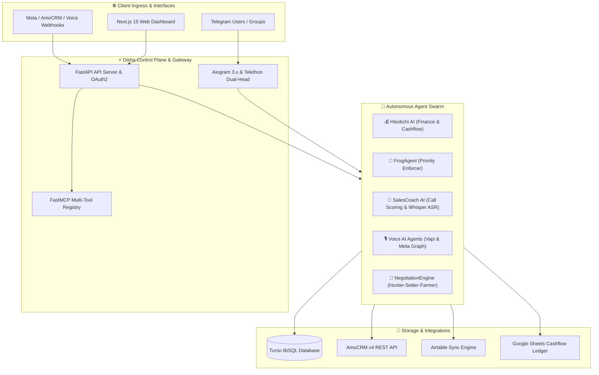

# 👸 Oisha OS

<div align="center">

**Autonomous AI Operating System & Business Intelligence Platform for Modern Agencies**

[](https://github.com/baxtiyorjongaziyev/oisha-os/actions/workflows/test.yml)
[](https://github.com/baxtiyorjongaziyev/oisha-os/actions/workflows/codeql.yml)
[](https://www.python.org/)
[](https://nextjs.org/)
[](https://fastapi.tiangolo.com/)
[](https://turso.tech/)
[](LICENSE)

[🌐 Live Platform](https://oisha.jonbranding.uz) • [📖 Architecture](docs/ARCHITECTURE.md) • [🛠 Sales OS Suite](docs/oisha-sales-os-suite.md) • [🤝 Contributing](CONTRIBUTING.md)

</div>

---

## 🌟 Overview

**Oisha OS** is an enterprise-grade, autonomous multi-agent operating system designed to orchestrate end-to-end agency business operations. It combines conversational intelligence, CRM pipeline automation, financial ledger tracking, voice agents, and real-time sales coaching into a unified platform.

Built with **Python 3.12**, **FastAPI**, **Aiogram 3.x / Telethon**, **FastMCP**, **Turso (libSQL)**, and a **Next.js 15 + NestJS** monorepo workspace.



---

## 🚀 Core Capabilities

### 1. 🧠 Autonomous Multi-Agent Swarm
* **💰 Hisobchi AI (Financial Controller)**: Real-time SMS & card receipt parsing, voice transaction extraction, double-entry cashflow categorization, debt tracking, and bidirectional Google Sheets synchronization.
* **🐸 FrogAgent (Daily Priority Enforcer)**: Analyzes deal pipeline margins and ROI to identify daily "Frog" tasks, delivering 09:00 AM Telegram operational briefings.
* **🎯 NegotiationEngine**: Surgical mission generator for account managers following the *Hunter-Setter-Farmer* methodology.
* **🎙 Voice & Call Intelligence**: Automated voice intake, Whisper ASR speech-to-text, and conversational sentiment scoring.

### 2. 📊 CRM & Revenue Intelligence (AmoCRM v4)
* **DeepSales Lead Intelligence**: Automated phone normalization, buyer persona enrichment, lead scoring, and automated task scheduling.
* **Metasell Conversation Engine**: Automatic transcript generation, key insight extraction, objection detection, and automatic CRM note synchronization.
* **Reportagram Analytics**: Real-time sales conversion funnels, stagnant lead alerts, and revenue forecasts.

### 3. ⚡ Telegram Dual-Head Control Plane & FastMCP
* **Safe Two-Head Architecture**: Clean separation between Aiogram 3.x (stateless bot webhooks & admin commands) and Telethon (Oracle VM dedicated userbot worker).
* **FastMCP Tool Registry**: 12 integrated MCP tools exposing Telegram history, AmoCRM pipeline mutations, Airtable project lookups, and Instagram Graph APIs with **Owner Approval Gates**.

### 4. 💼 SalesCoach AI Workspace (`salescoach-ai/`)
* **Full-Stack Monorepo**: Next.js 15 App Router web dashboard, NestJS REST API, BullMQ background audio processing queues, and PostgreSQL/Prisma persistence.
* **Interactive Coaching Player**: Synchronized audio playback with speaker diarization, automated scorecard evaluation, and sharable feedback URLs.

---

## 🏗 Repository Structure

```
oisha-os/
├── apps/                         # Monorepo Web Applications
│   ├── web/                      # Next.js 15 Tailwind Frontend
│   ├── api/                      # NestJS REST & WebSocket API
│   ├── worker/                   # BullMQ Transcription & Scoring Worker
│   └── whatsapp-gateway/         # Baileys WhatsApp Bridge
├── src/                          # Core Python Engine
│   ├── api/                      # FastAPI Routers (Health, OAuth2, CRM, Finance)
│   ├── handlers/                 # Telegram & Ingress Message Handlers
│   ├── schedulers/               # Background Cron Jobs & Autonomous Enforcers
│   ├── services/
│   │   ├── core/                 # Agent Implementations (Hisobchi, Frog, Voice)
│   │   └── ai/                   # LLM Routing, Whisper ASR, Gemini Vision
│   ├── db/                       # Turso / libSQL Repositories & Migrations
│   ├── boot.py                   # Runtime Orchestrator & Lifecycle Manager
│   └── settings.py               # Pydantic Settings & Environment Validation
├── packages/                     # Shared TypeScript Packages
│   ├── shared-types/             # Zod Schemas & Domain Interfaces
│   ├── ui/                       # Reusable React Component Primitives
│   └── config/                   # Shared TypeScript / Tooling Configs
├── scripts/                      # Operational Scripts, MCP Servers & Utilities
├── docs/                         # Architecture Specs, PRDs & API Reference
└── tests/                        # Comprehensive Pytest Suite (1440+ Tests)
```

---

## ⚡ Quick Start

### Prerequisites
- **Python 3.12+**
- **Node.js 20+** & **pnpm 10+**
- **Docker & Docker Compose** (Optional, for full stack services)

### 1. Clone & Configure Environment

```bash
# Clone the repository
git clone https://github.com/baxtiyorjongaziyev/oisha-os.git
cd oisha-os

# Copy environment template
cp .env.example .env
```

### 2. Python Backend Setup

```bash
# Create and activate virtual environment
python -m venv .venv
source .venv/bin/activate  # On Windows: .venv\Scripts\activate

# Install Python dependencies
pip install -r requirements.txt -r requirements-dev.txt

# Run FastMCP & API Server
python -m src.api_server
```

### 3. SalesCoach AI Web App Setup

```bash
# Install Monorepo Node dependencies
pnpm install

# Start development servers
pnpm dev
```

---

## 🧪 Testing & Quality Assurance

Oisha OS enforces strict code quality gates, static security analysis, and contract tests before any pull request is merged:

```bash
# 1. Run full unit & integration test suite (1440+ tests)
python -m pytest -q --tb=short

# 2. Run Bandit SAST Security Linter
bandit -r src/ -ll

# 3. TypeScript Typecheck & Monorepo Linting
pnpm typecheck
pnpm lint
```

---

## 🛡 Security & Privacy

- **Zero Open Vulnerabilities**: 100% compliant with CodeQL SAST and Dependabot security advisories.
- **Human-in-the-Loop Safeguards**: High-impact mutations (CRM deal updates, financial transfers, broadcast messages) require owner approval via Telegram inline callbacks.
- **Strict Credential Isolation**: Telegram session keys, API tokens, and OAuth credentials remain securely encrypted and never leak to client outputs or logs.
- For vulnerability reports, please consult [SECURITY.md](SECURITY.md).

---

## 🤝 Contributing

We welcome contributions from the open-source community! Please review [CONTRIBUTING.md](CONTRIBUTING.md) for our branch strategies, commit conventions, and pull request workflow.

---

## 📄 License

This project is licensed under the terms of the [MIT License](LICENSE).

<div align="center">
Built with ❤️ by <a href="https://github.com/baxtiyorjongaziyev">Baxtiyorjon Gaziyev</a> & the Jon Branding Team.
</div>
